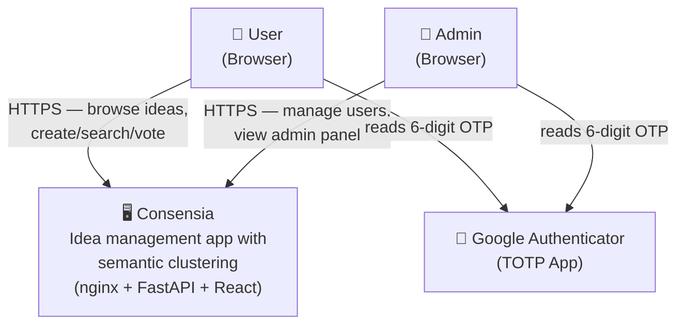
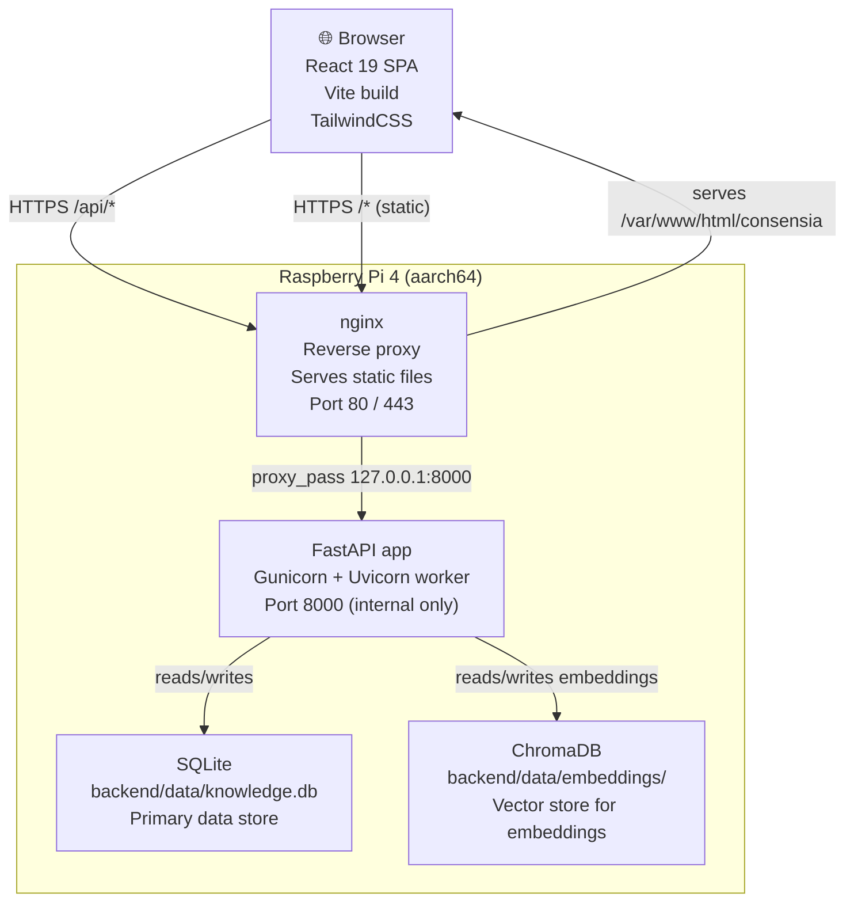
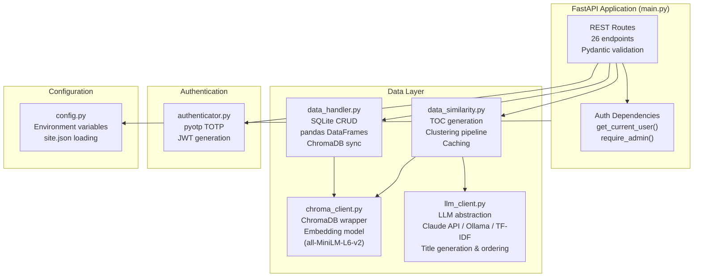
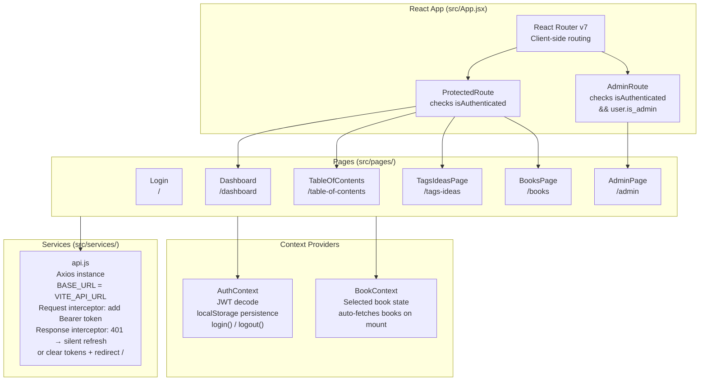
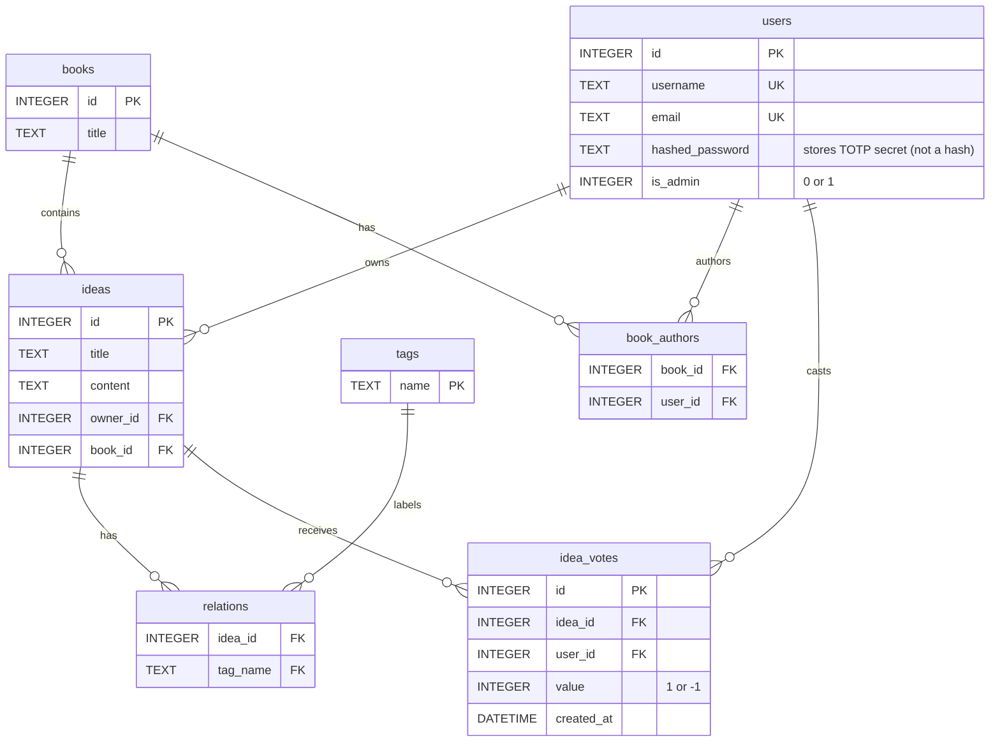
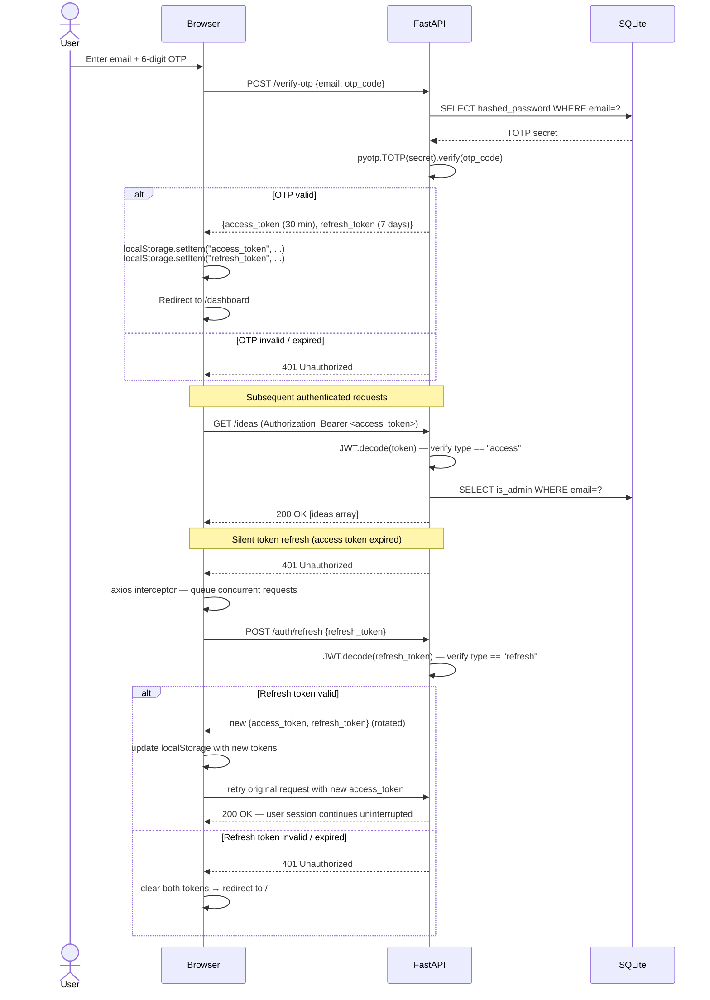
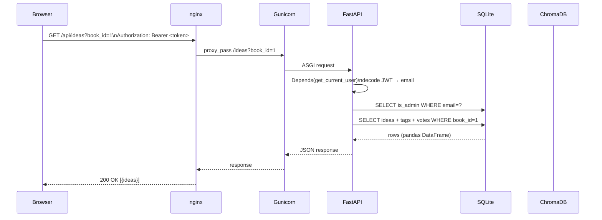

# Architecture

This document describes the full system architecture of Consensia, intended for developers joining the project. It covers system structure (C4 diagrams), the database schema, authentication flow, request lifecycle, and key design decisions.

---

## System Overview (C4 Level 1 — Context)

Consensia is a self-hosted, single-tenant web application. There are no external service dependencies beyond the TOTP app on the user's phone.

---

## Container Diagram (C4 Level 2)

**Key points:**
- nginx is the single entry point; the FastAPI port is never exposed publicly
- ChromaDB runs in-process (embedded, no separate daemon)
- SQLite is the source of truth; ChromaDB holds only the vector index

---

## Component Diagram (C4 Level 3 — Backend)

---

## Component Diagram (C4 Level 3 — Frontend)

---

## Database Schema

**Constraints:**
- `ideas.book_id` is `NOT NULL` — every idea must belong to a book
- `idea_votes` has a `UNIQUE(idea_id, user_id)` constraint — one vote per user per idea
- `relations` has a composite primary key `(idea_id, tag_name)`
- `book_authors` has a composite primary key `(book_id, user_id)`
- **No `ON DELETE CASCADE`** is defined anywhere (see [Key Design Decisions](#key-design-decisions))

**Important naming quirk:** The `hashed_password` column in `users` stores the raw TOTP secret — it is not a hash. The column name is a historical artefact.

---

## Authentication Flow

**JWT claims:**

| Claim | Access token | Refresh token |
|---|---|---|
| `sub` | user email | user email |
| `exp` | now + 30 minutes | now + 7 days |
| `type` | `"access"` | `"refresh"` |
| `is_admin` | boolean | boolean |
| Algorithm | HS256 | HS256 |

The `type` claim prevents cross-use: `get_current_user()` rejects any token where `type != "access"`, and `POST /auth/refresh` rejects tokens where `type != "refresh"`. Tokens without a `type` claim (issued before this feature) default to `"access"` for backwards compatibility.

The frontend decodes the JWT payload client-side (without signature verification) solely to read `is_admin` for UI decisions. All authorisation is enforced server-side on every request.

---

## Request Lifecycle

A typical authenticated request (e.g. `GET /ideas?book_id=1`) flows as follows:

**ChromaDB** is only involved in two cases:
1. Idea writes (insert/update/delete) — triggered asynchronously via `ThreadPoolExecutor`
2. `GET /ideas/similar/{idea}` — synchronous vector similarity query
3. `GET /toc/structure` or `POST /toc/update` — fetches all embeddings for clustering

---

## Environment Variables

| Variable | Default | Required | Description |
|---|---|---|---|
| `JWT_SECRET_KEY` | `your-secret-key-here-change-in-production` | **Yes** | JWT signing secret — change before deployment |
| `NAME_DB` | `backend/data/knowledge.db` | No | SQLite database file path |
| `CHROMA_DB` | `backend/data/embeddings` | No | ChromaDB persistent storage directory |
| `TOC_CACHE_PATH` | `backend/data/toc.json` | No | TOC JSON cache file path |
| `ALLOWED_ORIGINS` | loaded from `backend/data/site.json` | No | CORS allowed origins (set via `site.json`) |
| `ANTHROPIC_API_KEY` | (empty) | No | Claude API key for LLM-powered TOC titles and ordering |
| `LLM_MODEL` | `claude-haiku-4-5-20251001` | No | Claude model to use for TOC generation |
| `OLLAMA_URL` | `http://localhost:11434` | No | Ollama server URL for local LLM fallback |
| `OLLAMA_MODEL` | `phi3:mini` | No | Ollama model for local LLM fallback |
| `VITE_API_URL` | `http://localhost:8000` | No (prod: yes) | Backend base URL — set at frontend build time |

---

## Key Design Decisions

### No `ON DELETE CASCADE`

SQLite foreign keys are not enforced by default — `PRAGMA foreign_keys = ON` must be issued per connection, and the application does not do this. As a result:

- Deleting an idea does **not** remove its `relations` rows
- Deleting a tag does **not** remove its `relations` rows

This is a known quirk, deliberately pinned by integration tests. It means you may have orphan rows in the `relations` table.

### Asynchronous ChromaDB writes

Idea mutations (create, update, delete) write to SQLite synchronously, then submit a ChromaDB write to a `ThreadPoolExecutor` pool. This keeps API response times low at the cost of a brief window where SQLite and ChromaDB are slightly out of sync.

### JWT decoded client-side for UI only

The frontend reads `is_admin` from the JWT payload to show/hide the Admin link in the navbar. This does **not** bypass server-side authorisation — every admin endpoint calls `require_admin()` which re-reads `is_admin` from the database.

### Single Gunicorn worker

The systemd service uses `-w 1` (one worker). This is intentional: ChromaDB and SQLite do not handle concurrent writes gracefully in the current setup. Do not increase the worker count without adding proper locking.

### TOC caching

`GET /toc/structure` serves from a JSON cache (`data/toc.json`). The cache is only invalidated when `POST /toc/update` is called explicitly. This avoids re-running the expensive ML pipeline on every page load. The known side effect is that stale TOC structures are served after adding new ideas — users must manually trigger an update.

### `hashed_password` stores the TOTP secret

The `users.hashed_password` column stores the raw base32 TOTP secret. The misleading name is a historical artefact from an earlier design. It is not a hash.
