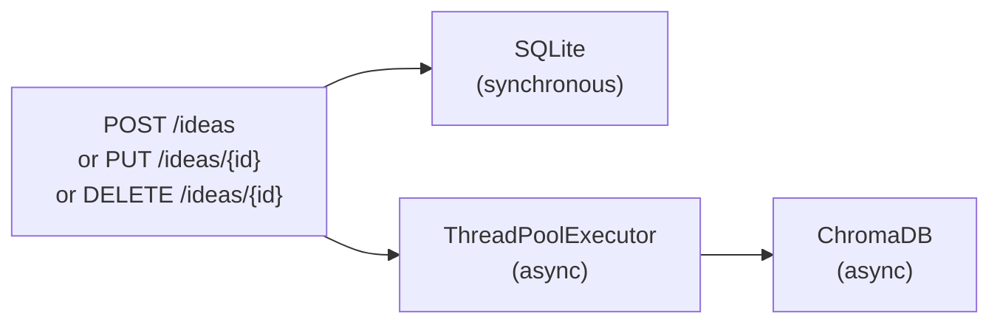
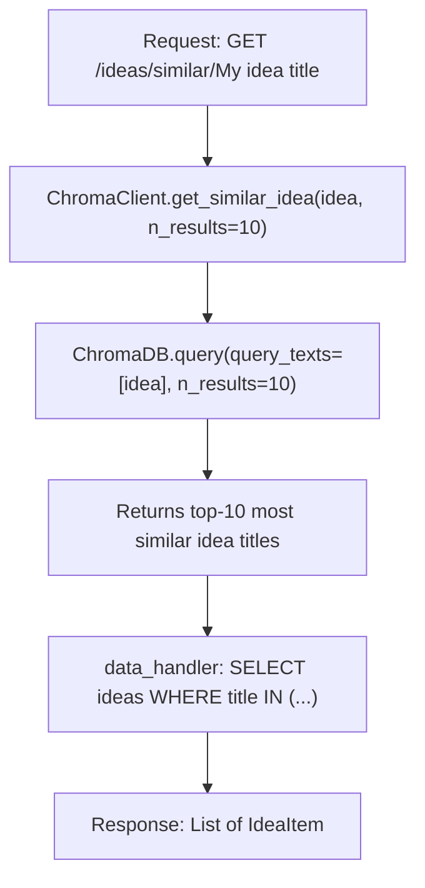
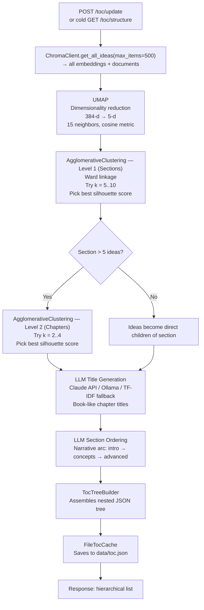

# Data Science & ML Pipeline

This document explains how Consensia uses machine learning to provide semantic similarity search and automatic Table of Contents generation. It is aimed at developers who want to understand, debug, or extend these features.

---

## Overview

Consensia treats each idea as a semantic unit, not just a text record. Two ML-powered features are built on top of this:

1. **Semantic similarity search** — "Find ideas similar to this one"
2. **Table of Contents generation** — "Automatically cluster all ideas into a meaningful hierarchy"

Both features rely on **dense vector embeddings**: a numerical representation of meaning that allows the system to measure conceptual proximity between ideas.

---

## Text Embedding

### Model

**Model:** `all-MiniLM-L6-v2` (SentenceTransformer)

This is a MiniLM model fine-tuned for sentence similarity. It produces 384-dimensional embeddings and is optimised for thematic clustering. It replaced the previous `all-distilroberta-v1` model for better clustering coherence while remaining lightweight on constrained hardware (Raspberry Pi 5).

**Migration note:** After changing the embedding model, all existing embeddings must be regenerated. Run `python scripts/migrate_embeddings.py` from the `backend/` directory.

### Document Construction

Ideas are not embedded as raw text. Instead, the `format_text()` utility in `backend/utils.py` constructs a structured document string:

```python
format_text(title, content, tags)
# → "Title: My idea\nContent: Detailed description\nTags: ai; hardware; robotics"
```

This document is what the model encodes. Weighting all three fields (title, content, tags) in the same string gives the model richer context than title alone.

### Embedding Storage

Embeddings are stored in **ChromaDB** (`backend/chroma_client.py`), a persistent vector database running in-process (no separate server). The collection is named `"Ideas"` and the storage path is configurable via the `CHROMA_DB` environment variable.

Each idea is stored with:
- **ID:** the idea title (string)
- **Document:** the `format_text(...)` output
- **Metadata:** `{"title": idea_title}`

### Write Path



SQLite writes are synchronous (blocking). ChromaDB writes are submitted to a thread pool so they do not block the HTTP response. There is a brief window after a create/update where SQLite and ChromaDB may be out of sync.

---

## Semantic Similarity Search

**Endpoint:** `GET /ideas/similar/{idea}`

**Flow:**



ChromaDB computes similarity using **cosine distance** between the query embedding and all stored embeddings. The query text is the idea title (not a full document) — ChromaDB re-encodes it at query time using the same `all-MiniLM-L6-v2` model.

---

## Table of Contents Generation Pipeline

The TOC feature (`GET /toc/structure`, `POST /toc/update`) automatically groups all ideas into a two-level hierarchy: **Sections → Chapters → Ideas**.

### Full Pipeline



### Step-by-step Explanation

#### 1. Fetch all embeddings

```python
ChromaClient.get_all_ideas(max_items=500)
# Returns: chromadb.GetResult with .documents, .ids, .embeddings
```

The raw 384-dimensional embeddings are used for clustering (not the document text).

#### 2. UMAP dimensionality reduction

UMAP (Uniform Manifold Approximation and Projection) reduces 384-d embeddings to 5 dimensions while preserving local structure. This makes clustering faster and more meaningful.

```python
umap.UMAP(n_neighbors=15, n_components=5, metric="cosine")
```

#### 3. Agglomerative clustering — Sections (Level 1)

```python
from sklearn.cluster import AgglomerativeClustering

# Tries k in [5, 10], picks k with highest silhouette score
AgglomerativeClustering(n_clusters=k, linkage="ward")
```

Ward linkage minimises intra-cluster variance, producing compact, well-separated clusters. Every idea is assigned to a cluster — no noise points (unlike HDBSCAN which was used in an earlier version).

#### 4. Agglomerative clustering — Chapters (Level 2)

For sections with more than 5 ideas, a second round of clustering subdivides them into 2–4 chapters:

```python
# Tries k in [2, 4], picks k with highest silhouette score
AgglomerativeClustering(n_clusters=k, linkage="ward")
```

#### 5. LLM-powered title generation

Each cluster is given a book-like chapter title using an LLM (Claude API, Ollama, or TF-IDF fallback). The system sends all section idea summaries in a single batch API call and receives evocative, human-readable titles.

**Fallback chain (3 levels):**

1. **Claude API** (if `ANTHROPIC_API_KEY` is set) — best quality, uses `claude-haiku-4-5-20251001`
2. **Ollama** (if a local server responds on `OLLAMA_URL`) — offline, free, uses configurable model
3. **TF-IDF** (always available) — keyword extraction with `TfidfVectorizer`

The LLM client abstraction is in `backend/llm_client.py` and follows the `LlmPort` Protocol for testability.

#### 6. LLM-powered section ordering

After titles are generated, sections are reordered to create a coherent narrative arc. The LLM determines the optimal reading order: foundational concepts first, then applications, then advanced topics.

Without an LLM, sections appear in the original clustering order.

#### 7. Originality score

Each idea receives an **originality score** (0.0–1.0) representing how far it sits from its cluster centroid. Ideas with high originality are conceptually distant from the "typical" idea in their cluster — they may be outliers or uniquely creative.

```python
# originality = normalized distance from centroid within its cluster
```

#### 8. Tree assembly and caching

`TocTreeBuilder` assembles the nested JSON tree. `FileTocCache` writes it to `data/toc.json`. Subsequent `GET /toc/structure` calls serve the cached file without re-running the pipeline.

---

## Caching Strategy

| Event | Cache state |
|---|---|
| `GET /toc/structure` (cache exists) | Served from `data/toc.json` — no ML computation |
| `GET /toc/structure` (no cache) | Pipeline runs, result cached |
| `POST /toc/update` | Pipeline runs, cache overwritten |
| Idea created / updated / deleted | Cache is **not** invalidated automatically |

This means the TOC can be stale after idea mutations. Users must click "Update Structure" to refresh it.

---

## Regenerating Embeddings

If you need to re-sync ChromaDB after a data migration, run:

```bash
cd backend
source venv/bin/activate
python scripts/migrate_embeddings.py
```

This reads all ideas from SQLite, deletes the old ChromaDB collection, recreates it with the current embedding model (`all-MiniLM-L6-v2`), and re-inserts all ideas. SQLite is the source of truth — ChromaDB is always reconstructable from it.

---

## Design Alternatives Considered

### Why not HDBSCAN?

An earlier version used HDBSCAN (a density-based algorithm). It is still available as `EmbeddingAnalyzer` in `data_similarity.py` for backward compatibility. The current default is `ConstrainedClusteringAnalyzer` (Agglomerative), which was chosen because:

- HDBSCAN produces **noise points** — ideas that don't fit any cluster. These had to be handled as isolated leaf nodes, producing an uneven TOC.
- Agglomerative clustering guarantees every idea is in a cluster, producing a cleaner hierarchy.
- Silhouette-based k selection gives more predictable cluster counts.

### Why `all-MiniLM-L6-v2`?

- Better thematic clustering quality than the previous `all-distilroberta-v1`
- Smaller 384-d embeddings (vs. 768-d) — faster UMAP reduction
- Lighter memory footprint on constrained hardware (Raspberry Pi 5)
- Excellent performance on sentence similarity benchmarks

To switch models, change `model_name` in `chroma_client.py`, then run `python scripts/migrate_embeddings.py` to regenerate all embeddings.

### Why LLM-assisted title generation?

The previous TF-IDF approach extracted keywords and joined them with " & " (e.g. "Machine Learning & Hardware"). Users found these titles uninformative. The LLM generates real book-like chapter titles (e.g. "Building Intelligent Systems") that better represent the section content.

The 3-level fallback (Claude → Ollama → TF-IDF) ensures the system always works, even without any LLM available.
